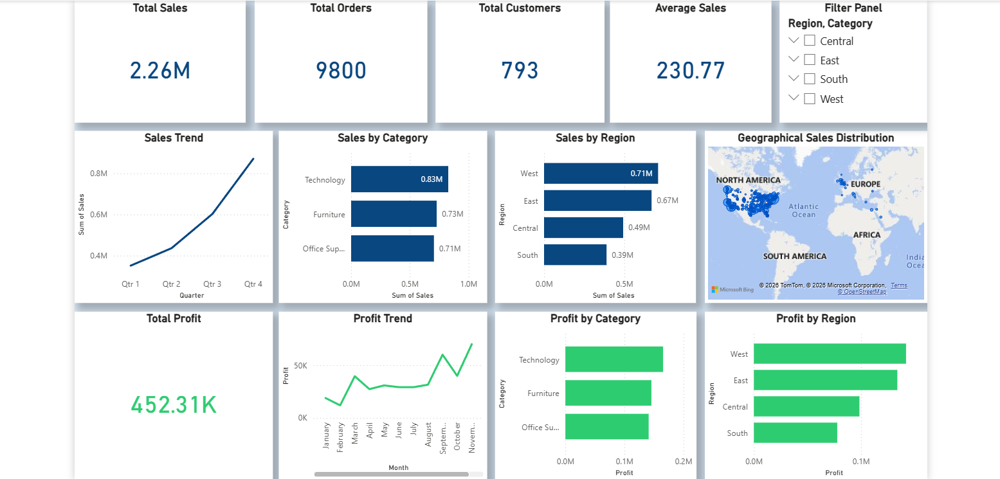

# 📊 Sales & Profit Analysis Dashboard (Power BI)

## 🚀 Project Overview

This project presents an interactive **Power BI dashboard** built using a real-world retail dataset sourced from Kaggle.
The dashboard provides actionable insights into **sales performance, customer behavior, regional trends, and profitability**.

It demonstrates end-to-end data analysis workflow including **data cleaning, modeling, and visualization**.

---

## 📌 Dataset Source

Dataset taken from Kaggle:
👉 https://www.kaggle.com/datasets/rohitsahoo/sales-forecasting

---

## 📊 Key Insights Delivered

* 📈 **Total Sales:** 2.26M+
* 🧾 **Total Orders:** 9800+
* 👥 **Total Customers:** 793
* 💰 **Total Profit:** 452K+
* 📊 **Average Sales per Order**

---

## 📊 Dashboard Features

### 🔹 Sales Analysis

* Sales Trend (Year/Quarter wise)
* Sales by Category
* Sales by Region
* Geographical Sales Distribution (Map)

### 🔹 Profit Analysis

* Total Profit KPI
* Profit Trend (Month-wise)
* Profit by Category
* Profit by Region

### 🔹 Interactive Filtering

* Region-wise filtering
* Category-wise filtering
* Dynamic visual updates based on user selection

---

## 🧠 Tools & Technologies Used

* **Power BI Desktop**
* **Power Query** – Data cleaning & transformation
* **DAX (Data Analysis Expressions)** – KPI calculations
* **Data Modeling** – Relationships & structure
* **SQL Concepts** – Used for data understanding and aggregation logic

---

## 🗂️ Dataset Information

* Type: Retail Sales Dataset
* Source: Kaggle
* Fields included:

  * Order ID
  * Customer ID
  * Sales
  * Profit
  * Category / Sub-category
  * Region
  * Order Date
  * Location (City, Country)

---

## 📸 Dashboard Preview

---

## 📁 Project Files

* `sales-profit-dashboard-powerbi.pbix` → Power BI dashboard file
* `sales_dataset.csv` → Dataset used
* `sales-profit-dashboard-preview.png` → Dashboard preview image

---

## 💡 Key Learnings

* Designing business-focused dashboards
* Creating KPI cards using DAX
* Building interactive reports with slicers
* Implementing geographical map visuals
* Applying conditional formatting for better insights
* Structuring dashboards for real-world analytics

---

## 📌 Future Improvements

* Forecasting (Time Series Analysis)
* Drill-through reports
* Advanced DAX calculations
* Row-level security (RLS)

---

## 👨‍💻 Author

**Amit Roy**

Data Analyst | SQL | Power BI | Python | Excel | Dashboard Developer | Turning Data into Business Insights

📍 Kolkata, India

---

## ⭐ If you found this useful, give it a star!
